# 云计算与并行技术 课程设计
## 一、数据预处理

数据集

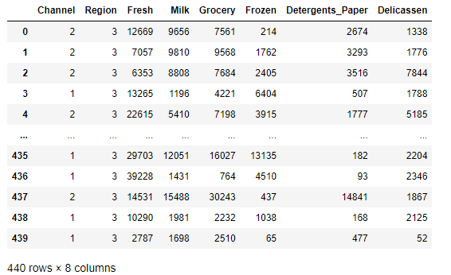

聚类时只用到后6个特征

1) FRESH: annual spending (m.u.) on fresh products (Continuous);
2) MILK: annual spending (m.u.) on milk products (Continuous);
3) GROCERY: annual spending (m.u.)on grocery products (Continuous);
4) FROZEN: annual spending (m.u.)on frozen products (Continuous)
5) DETERGENTS_PAPER: annual spending (m.u.) on detergents and paper products (Continuous)
6) DELICATESSEN: annual spending (m.u.)on and delicatessen products (Continuous); 

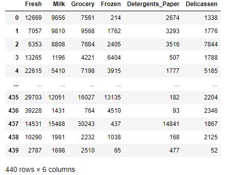

 

可以发现Fresh列到Delicassen列的数据数量级大小差别很大，在聚类前需要进行标准化 ，因此将特征归一化到0-1区间内

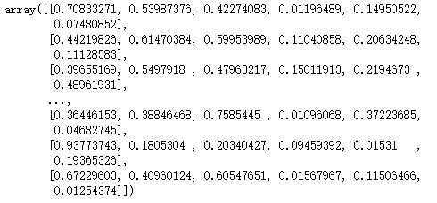

至此数据处理完毕，将矩阵导出为文件

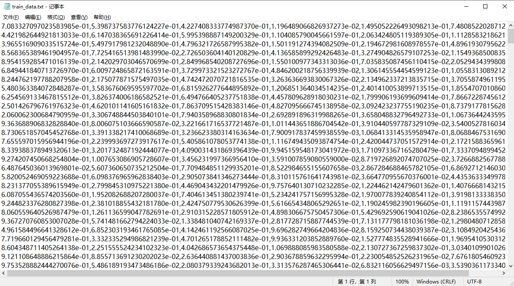

## 二、Experiment

硬件配置：

> Master x1  CPU-core 4  Memory 4G Disk 100G
>
> Slave    x1  CPU-core 4  Memory 4G Disk 100G

参数配置

> k = 3, 4, 5, 6
>
> epoch 30
>
> map worker x2  reduce worker x1

首先介绍实验运行的过程，然后再分别针对不同cluster个数的结果进行分析

我们将输入文件夹和输出文件夹分别设置为input和output，并将数据集上传至hdfs

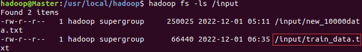

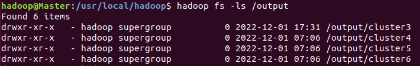

将java代码导出为jar包后，开始运行

hadoop jar kmeans.jar kmeans.KmeansRun train_data.txt 3 

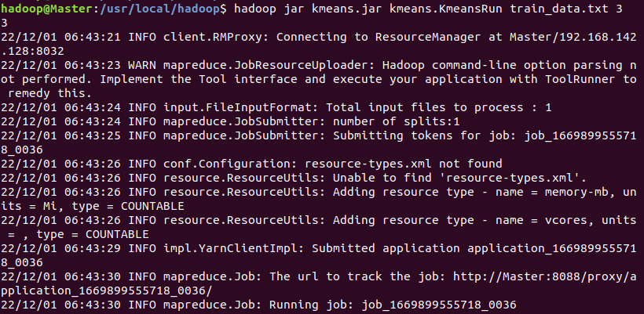

运行结束

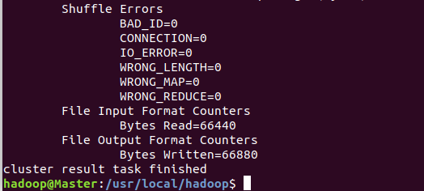

查看结果可以发现输出文件夹中多了初始聚类中心、聚类结果以及最终聚类中心

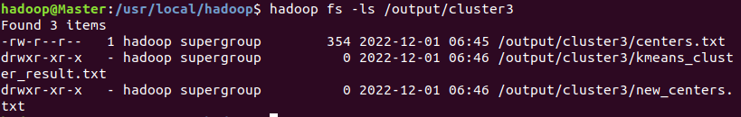

我们将结果从hdfs上下到本地

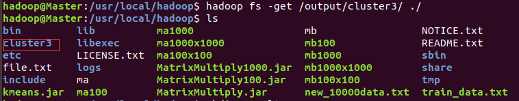

### 2.1 cluster=3

聚类结果

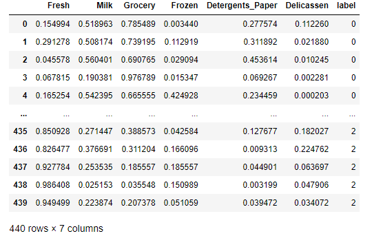

类别统计

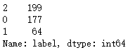

聚类中心

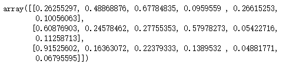

可视化 散点矩阵图

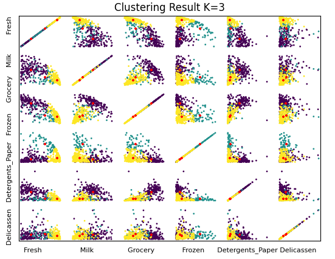

### 2.2 cluster=4

聚类结果

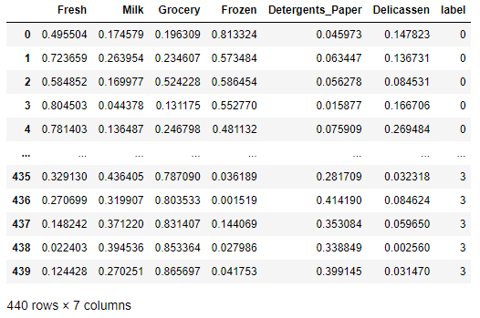

类别统计

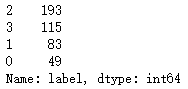

聚类中心

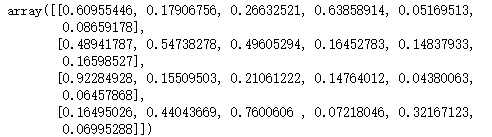

可视化 散点矩阵图

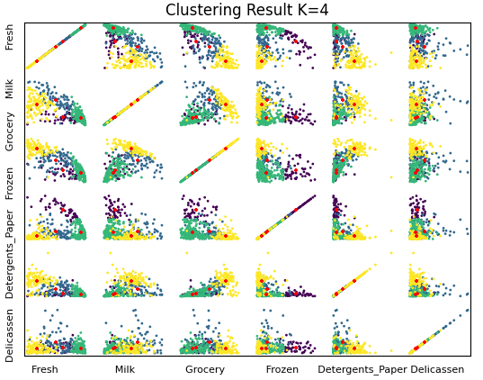

### 2.3 cluster=5

聚类结果

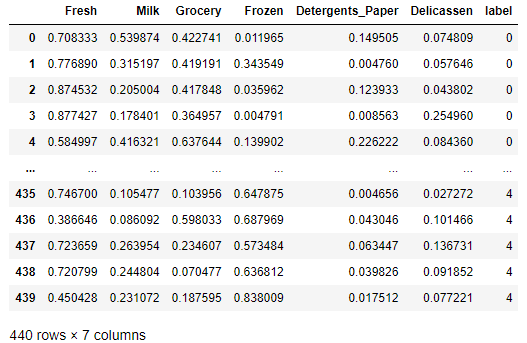

类别统计

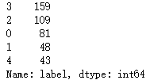

聚类中心

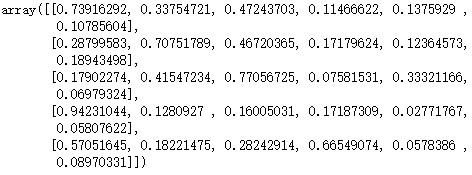

可视化 散点矩阵图

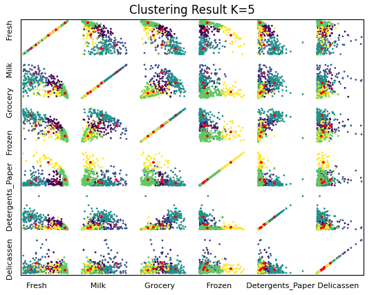

### 2.4 cluster=6

聚类结果

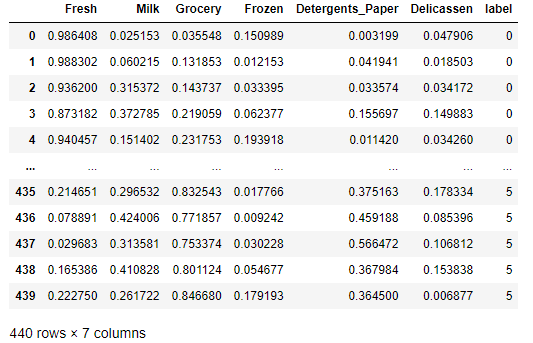

类别统计

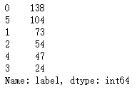

聚类中心

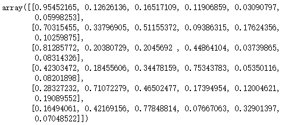

可视化 散点矩阵图

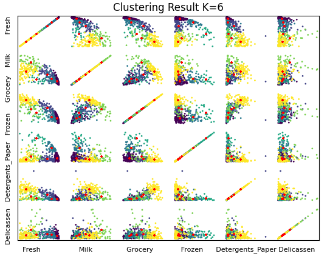

